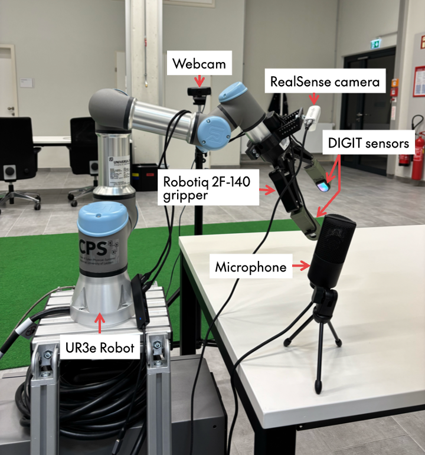

# 🤖 UR3e Python Teleop
This repository contains code to teleoperate a UR3e-2 cobot with a wrist-attached Robotiq 2F-140 two-finger gripper using Python. 
Codes for two methods of teleoperation are provided:
1. Keyboard-based, and,
2. PlayStation 5 (DualSense) controller-based.

The repository also contains code for a 'sensor manager' that can be used to start and stop recordings from multiple sensors simultaneously based on keyboard inputs.

Further instructions for each part are provided in the README.md of their respective directories.

## Experimental Setup



### Hardware Requirements
#### Teleoperation:
The setup involves:
1. UR3e Robotic Arm
2. 2F-140 Robotiq two-finger gripper
3. Keyboard / PlayStation 5 (DualSense) controller

#### Sensor capture:
The 'sensor manager' is intended to be used along with a simultaneously teleoperated robot. Therefore, in addition to the above components, the sensors required include:
1. Webcam to view the entire setup
2. DIGIT sensors on the gripper fingers
3. RealSense camera mounted on the gripper
4. Microphone to record gripper audio

### Software Requirements
- **OS:** Ubuntu 22.04.5 LTS
- **Python:** 3.10 Virtual Environment
- **PolyScope:** 5.15

## Setup and Installation
These are the steps to be followed before running any of the codes in this repository. 
The steps for initial robot setup are mentioned in detail in '*ROBOT_SETUP.md*' in this repository.

### Initial Computer Setup and Installation
1. Clone the repository.
```
git clone https://github.com/Sujatha-H/UR3e-Python-Teleop
cd UR3e-Python-Teleop
```
2. Create a Python 3.10 virtual environment.
3. Install the necessary packages from 'requirements.txt'.
```
pip install -r requirements.txt
```

### Robot Setup After Every Startup
After the initial robot setup, there are some steps to be followed for setup after every power up of the robot in order to run the Python programs for teleoperation. These are as follows:
1. Go to Installation > URCaps > Gripper, and ensure that the gripper is detected. Once detected, activate the gripper using the 'Activate' button.
2. Go to Run (Left-most button at the top of the screen). Ensure that the title of your default program, 'robotiq_gripper_python', is shown under 'Program' (steps to download the UR program are given in detail in *ROBOT_SETUP.md*).
3. Under 'Control', click the 'play' button to start playing the program. This UR program must be running whenever the Python program is run.
4. Put the robot in 'Remote Control' mode using the button on the top-right of the screen.

## Teleoperating the Robot
Before running either of the following codes, ensure that you fill in the static IP address of your robot in the variable '*robot_ip*' in that code (for example, robot_ip = "192.168.1.222").

### I. Keyboard-based
In order to implement the keyboard-based teleoperation, run the following command:
```
cd /path/to/repository/UR3e-Python-Teleop
sudo .venv/bin/python Teleop/teleop_keyboard.py
```
This code requires sudo permission due to the use of the 'keyboard' module.

### II. PlayStation 5 controller-based
In order to implement the PlayStation 5 controller-based teleoperation, run the following command:

(Ensure that your PS5 controller is connected to your computer via Bluetooth before running the command.)
```
cd /path/to/repository/UR3e-Python-Teleop
.venv/bin/python Teleop/teleop_ps5.py
```
Further instructions on how to use each of these programs are mentioned in the README.md in the '*Teleop*' directory.

## Sensor Capturing
Before running the sensor capture code, ensure that all your sensors are connected to your computer. Fill in the following variables:
1. '***robot_ip***' in *sensor_manager.py* with your robot's static IP address 
   (for example, robot_ip = "192.168.1.222")
2. '***root_dir***' in *sensor_manager.py* with the path to the directory where you want your sensor data to be saved (for example, root_dir = "/home/user/SensorCapture")
3. Line 17 (***if " " in name:***) in *find_microphone_index()* in *audio_capture.py* with the name of your audio device (for example, if "pnp audio" in name:). 
   - In order to find the name of your device, open a Python script and run the following command:
   ```
   import sounddevice as sd
   print(sd.query_devices())
   ```
   - Identify your microphone and modify the string with its name.

Then run the following command to begin sensor capture:
```
sudo PYTHONPATH=$(pwd) .venv/bin/python SensorManager/sensor_manager.py
```
Further details about each sensor capture function are mentioned in the README.md in the '*SensorManager*' directory.

## Known Issues
The teleoperation codes do not check for singularities, and so, if a singularity is reached, the robot will enter a protective stop. The robot may require being restarted in order for the Python program to work again.